# 🐝 TestBee: Enterprise RAG (Retrieval-Augmented Generation) Platform

TestBee is a production-grade, GPU-accelerated RAG pipeline designed to ingest, chunk, embed, and index dense academic textbooks (such as NCERT PDFs) and serve them via an interactive, curriculum-aware Telegram tutor bot. 

Powered by **Docling** for layout-aware document extraction, **BGE-M3** for dense vector representations, **Supabase pgvector** for enterprise-scale vector search, and **Sarvam AI** for low-latency chat completions, TestBee provides calibrated depth-level answering for CBSE and JEE preparation.

---

## 🏗️ System Architecture

```mermaid
graph TD
    %% Ingestion Pipeline
    subgraph Ingestion Pipeline [1. Ingestion & Embedding Pipeline]
        A[Raw PDFs] -->|Folder Structure Auto-detect| B[Docling PDF Parser]
        B -->|Layout-aware Chunking| C[Hybrid Chunker]
        C -->|inject_metadata| D[Tagged Chunks]
        D -->|Local GPU / CPU| E[BAAI/bge-m3 Model]
        D -->|Modal Sidecar HTTP| F[Modal Embedding Endpoint]
        E --> G{Target Store}
        F --> G
        G -->|Cloud Production| H[(Supabase pgvector)]
        G -->|Local Development| I[(ChromaDB)]
    end

    %% Query / Serving Bot
    subgraph Bot Serving [2. Query & Answer Generation]
        J[Telegram User] -->|1200 Char Max Limit| K[telegram_bot.py]
        K -->|/setgrade & /setsubject| L{Session Filter}
        K -->|/setcurriculum| M[Preamble Calibration]
        L -->|Embed Query| N[embed.py]
        N -->|Filter & Similarity Query| O[supabase_retrieve.py / retrieve.py]
        O -->|Top 8 Chunks| P[generate.py]
        M -->|Inject CBSE/JEE Prompt| P
        P -->|Call completions| Q[Sarvam AI sarvam-m]
        Q -->|LaTeX Math Expressions| R[latex_formatter.py]
        R -->|Unicode conversion| S[Inline Formulas]
        R -->|matplotlib rendering| T[PNG Images]
        S --> U[Formatted Message Parts]
        T --> U
        U -->|Send reply| J
    end
```



---

## 🌟 Key Enterprise Features

* **Docling Layout-Aware Processing:** Bypasses noisy PDF layout parsing issues by retaining structured tables, headers, and reading order.
* **Hybrid Embedding Scale:** Supports local GPU embedding via PyTorch/CUDA, or high-throughput remote embedding through a cloud-based **Modal sidecar HTTP endpoint** (skips local model loading to conserve local resources).
* **Calibrated Curriculum Prompts:** Dynamically adjusts answering depth and style (formulas vs. concepts) depending on the selected curriculum:
  * **CBSE:** Explanations and standard board-exam examples.
  * **JEE Main:** Formula-heavy, application-oriented, and problem-solving focused.
  * **JEE Advanced:** In-depth conceptual derivations and multi-concept reasoning.
* **Aesthetic Math Formatting:** Automatically parses LaTeX formulas in responses, converting inline expressions to Unicode and rendering complex block math ($$\dots$$) as high-resolution PNG images sent as photo attachments.
* **Enterprise Guardrails & Security:**
  * Strict limits on user query lengths (max 1200 characters) to prevent prompt injection and token fatigue.
  * Exception containment: keeps raw server stack traces internal and returns user-friendly messages.
  * Multi-stage, VRAM-separated ingestion phases to prevent GPU Out-of-Memory (OOM) failures.

---

## 📁 Repository Directory Structure

```text
TestBee-Rag-Template/
├── data/
│   ├── raw_pdfs/              # PDF files placed in 4-segment directories
│   │   └── <curriculum>/<classXX>/<subject>/<filename>.pdf
│   ├── models/                # Local cache directory for model checkpoints
│   │   └── bge-m3/            # BAAI/bge-m3 SentenceTransformer checkpoint
│   └── vector_store/          # Local ChromaDB persistent files (sqlite)
├── src/
│   ├── config.py              # Path resolution, metadata schemas, env loading
│   ├── ingest.py              # Docling document extraction and metadata mapping
│   ├── embed.py               # Local BGE-M3 or Modal HTTP sidecar embeddings loader
│   ├── retrieve.py            # ChromaDB local retrieve implementation
│   ├── supabase_migrate.py    # Batch migration script from ChromaDB to Supabase
│   ├── supabase_retrieve.py   # Supabase client and match_chunks RPC wrapper
│   ├── generate.py            # Context budgeting, prompt building, and Sarvam AI completions
│   ├── latex_formatter.py     # LaTeX text-to-Unicode and display math matplotlib renderer
│   └── telegram_bot.py        # Long-polling Telegram bot listener and command handler
├── run_ingest.py              # Full/Subject-specific 3-phase ingestion runner
├── run_ingest_parallel.py     # Multiprocessing concurrent CPU ingestion runner
├── supabase_setup.sql         # SQL script to initialize tables, indexes, and RPC functions
├── requirements.txt           # Pip dependencies list
└── README.md                  # Project documentation
```

---

## ⚙️ Prerequisites & Installation

### 1. Clone & Set Up Virtual Environment

```bash
git clone <repository-url>
cd TestBee-Rag-Template

# Create virtual environment
python -m venv .venv
source .venv/bin/activate  # Linux/macOS
.venv\Scripts\activate     # Windows PowerShell
```

### 2. Install Project Dependencies

For CPU/General runs:
```bash
pip install -r requirements.txt
```

#### 🔌 Local GPU Setup (Recommended for Ingestion/Embeddings)
Docling and BGE-M3 run significantly faster on a CUDA-enabled GPU. Ensure you install a GPU-compatible version of PyTorch in the virtual environment:
```powershell
# Upgrade PyTorch with CUDA 12.4 support (Windows/Linux)
.venv\Scripts\python.exe -m pip install --upgrade torch torchvision torchaudio --index-url https://download.pytorch.org/whl/cu124
```
Validate GPU detection:
```powershell
.venv\Scripts\python.exe -c "import torch; print(torch.cuda.is_available(), torch.cuda.get_device_name(0))"
# Output should display: True and your GPU model (e.g. RTX 4060)
```

### 3. Fetch Local Embedding Model
If you are running the embedding pipeline locally (not using the Modal HTTP sidecar), download and save the BGE-M3 model files locally before ingestion:
```bash
python -c "from sentence_transformers import SentenceTransformer; SentenceTransformer('BAAI/bge-m3').save('data/models/bge-m3')"
```

---

## 🗄️ Database Setup (Supabase pgvector)

If you are using Supabase as your primary production vector store, execute the contents of [supabase_setup.sql](file:///c:/Users/rentk/Downloads/TestBee-Rag-Template/supabase_setup.sql) in the **Supabase SQL Editor**:

1. **Enable pgvector:** Installs the `vector` extension.
2. **Table Creation:** Creates the `textbook_chunks` table containing columns for raw text, a `vector(1024)` representation, and structural metadata tags.
3. **Optimized Indices:** Builds an HNSW index for approximate cosine similarity queries and a B-Tree composite index on `(grade_level, subject)` to enable rapid pre-filtering.
4. **RPC Function:** Installs the `match_chunks` function to perform similarity matches under filter queries:
```sql
CREATE OR REPLACE FUNCTION match_chunks(
    query_embedding vector(1024),
    grade_filter    INTEGER,
    subject_filter  TEXT,
    match_count     INTEGER DEFAULT 8
)
...
```

---

## 📝 Configuration & Environment Variables (`.env`)

Create a `.env` file in the root directory:

```env
# --- Supabase Configuration ---
SUPABASE_URL=https://<your-project-ref>.supabase.co
SUPABASE_SERVICE_KEY=<your-service-role-secret-key> # Needed for write/ingest scripts
SUPABASE_KEY=<your-anon-public-key>                 # Needed for read-only bot queries

# --- Large Language Model Completion ---
SARVAM_API_KEY=srvm-....                            # Sarvam completions API Key

# --- Telegram Bot Token ---
TELEGRAM_BOT_TOKEN=0000000000:AA....                 # Bot Token from BotFather

# --- Optional Ingest Customization ---
# INGEST_SUBJECT=maths                              # Constrains run_ingest.py unless --all is set
# RAG_SIDECAR_URL=https://<modal-id>.modal.run      # Routes embedding to Modal HTTP endpoint (skips local loading)
# TESTBEE_ALLOW_CPU_EMBED=1                         # Force CPU embedding (debug mode only)
# TESTBEE_HF_OFFLINE=1                              # Force HF to run offline (assumes cached files)
```

---

## ⚡ Running the Ingestion Pipeline

### Directory Layout Convention
Place raw textbooks in the following hierarchy under `data/raw_pdfs/`:
```text
data/raw_pdfs/<curriculum>/<classXX>/<subject>/<filename>.pdf
```
*Example:* `data/raw_pdfs/cbse/class11/physics/keph101.pdf` (where `keph101` maps to `"Units and Measurement"`).

### Option A: Standard 3-Phase Ingestion Runner (GPU-optimized)
This is the recommended runner. It separates PDF parsing from vector embedding generation to manage VRAM occupancy and prevent collisions.
```bash
# Ingest all PDFs, ignoring any subject overrides
python run_ingest.py --all

# Ingest only a specific subject folder (e.g. maths)
python run_ingest.py --subject maths
```

### Option B: Parallel Ingestion Runner (Multiprocessing CPU)
Concurrently converts multiple PDFs using `ProcessPoolExecutor` to speed up layout-parsing on multi-core CPUs, followed by sequential embedding and ChromaDB persistence.
```bash
python run_ingest_parallel.py
```

### Option C: Migrate ChromaDB to Supabase
If you previously ingested files locally into ChromaDB and wish to upload them to Supabase:
```bash
python src/supabase_migrate.py
```

---

## 🤖 Launching the Telegram Tutor Bot

Start the long-polling Telegram bot process:
```bash
python src/telegram_bot.py
```

### Bot Commands
To ensure accurate context retrieval, the student's current chat session must align with the metadata tags of the textbooks in the database. Instruct users to configure their session settings before asking:

* `/start` - Welcomes the user and initializes the session state to the defaults (CBSE, Grade 12, Chemistry).
* `/setgrade <11 | 12>` - Configures the grade-level filter.
* `/setsubject <Physics | Chemistry | Maths>` - Sets the subject context.
* `/setcurriculum <CBSE | JEE_Main | JEE_Advanced>` - Adjusts answer detail level.

---

## 🔍 Observability, Latency & Error Handling

`telegram_bot.py` records comprehensive, structured latency profiles. Each user request logs a one-line metric to the console or file:
```text
2026-06-05 12:00:00,123 [INFO] telegram_bot: question_handler ok request_id=tg-987654321 chat_id=123456789 user_id=123456789 subject=Physics grade=11 chunks=8 reply_parts=1 formulas=2 elapsed_ms=1432
```
* **Request Guard:** Requests larger than 1200 characters are intercepted and rejected early to prevent API degradation.
* **LaTeX Cleanup:** Removes raw LLM chain-of-thought blocks (`<think>...</think>`) before parsing math structures to ensure pristine markdown formatting.
* **Webhook Cleaning:** Runs automated webhook deregistrations upon initialization to ensure stable long-polling connectivity even after unexpected bot termination.

---

## 🔒 Security Best Practices

1. **API Keys Protection:** Never commit the `.env` file or hardcode keys. The `.gitignore` is pre-configured to ignore `.env` and `data/` directories.
2. **Access Control:** Always use the `anon` public key in the client bot (`SUPABASE_KEY`). Utilize the `service_role` key (`SUPABASE_SERVICE_KEY`) strictly in write-only pipelines.
3. **SQL Policies:** Ensure the `allow_anon_select` and `allow_service_insert` Row Level Security policies remain enabled in production.
